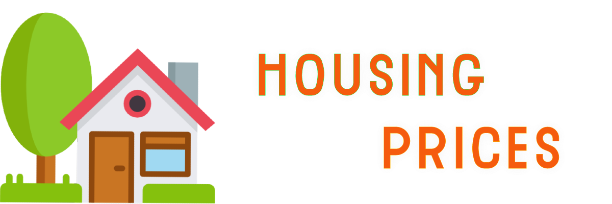

A notebook that uses Housing Prices dataset on kaggle to predict a house price, this notebook includes Data Exploration with visualizations, Data Wrangling and Model building.
[Competition Link](https://www.kaggle.com/c/home-data-for-ml-course/overview)

## Used Models:
| Model | Parameters|
| ---------|---------------------------------|
| XGBRegressor | Defaults with **max_depth** = 15, **n_estimators** =200, **eta** (learning_rate) = 0.2 |
| XGBFRegressor | Defaults with **max_depth** = 15, **n_estimators** =200, **eta** (learning_rate) = 0.2 |
| GradientBoostingRegressor |  Defaults with **max_depth** = 15, **n_estimators** =200, loss = 'huber' |

## Score: :trophy:

| Mean Square Error | 15900 |
| ----------- | ----------- |
| ranked | 5946 (**TOP 11%**)|

## Machine Learning Workflow :three: :arrows_counterclockwise:
1.  Data Exploration :hammer:
     *  univariate Exploration.
     *  Bivariate Exploration.
2.  Data Preprocessing :wrench:
     *  Missing Values using **pandas interpolate**
     *  Creating new Features ( Remodled, HasPorch )
     *  Drop Useless Features
     *  Apply StandardScaler
3.  Model Building :dart: 

     using Stackregressor I stacked three models
     *  XGBRegressor
     *  XGBFRegressor
     *  GradientBoostingRegressor

## Things I learned :memo:
1.  One Hot Encoding was better than label encoder here, since most of the categorical variables are not ordinal (it improved the model performance a lot)
2.  using one hot encoding introduced the problem of Multicollinearity , to overcome this probelm we need to drop one of the dummy columns (set drop_first = True)
3.  StackingRegressor is greatly beneficial when it comes to regression problems, I used it here with (cv = 5) that is KFold cross-validation 
4.  pandas function **interpolate** is a better way to handle missing values, that's how i improved the score